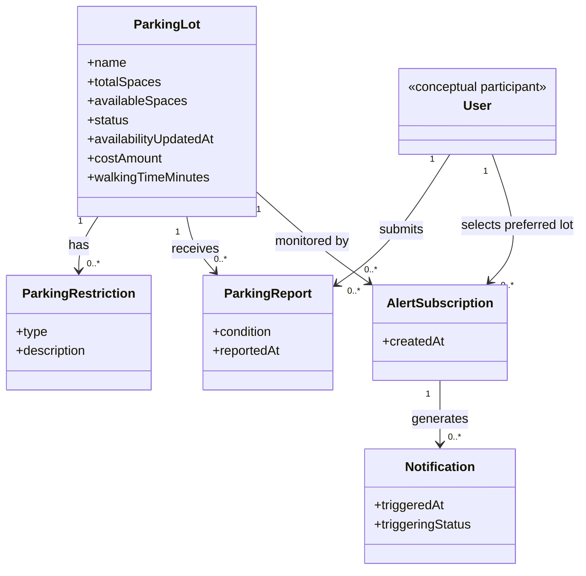

# AI Domain Model — First Draft

## AI Tool
GitHub Copilot

## Prompt

Using the M2 requirements for my UofM Parking Survival App, create a first draft of a domain model.

The app helps students find and understand parking near the University of Memphis and downtown Memphis.

The system needs to support parking information such as:

* parking lot availability
* total and available spaces
* parking cost
* parking restrictions
* walking distance
* parking status such as Available, Nearly Full, or Full
* user reports about parking conditions
* notifications when a parking lot is filling up

Create a simple domain model for the current requirements.

Use only entities that are actually supported by the requirements. Do not add unnecessary entities such as roles, permissions, audit logs, settings, authentication, or payment systems unless the requirements specifically require them.

Show the entities, important attributes, and relationships between entities.

Explain why each entity and relationship exists.

## Original AI Draft

UofM Parking Survival App — Draft Domain Model

This first draft models the concepts required by the current M2 requirements.
It does not assume accounts, authentication, maps, GPS tracking, payments, or
how a notification is delivered.

## Domain diagram

