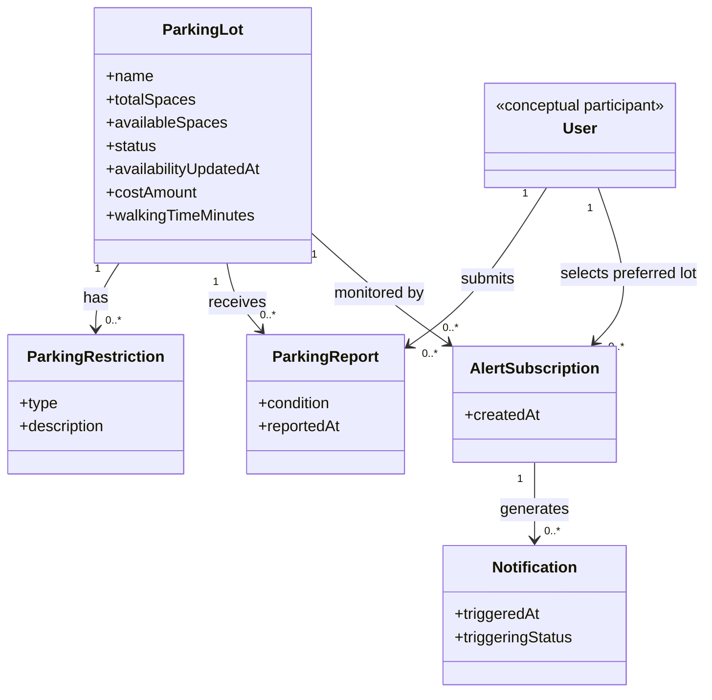

# AI Domain Model — First Draft

## AI Tool
GitHub Copilot

## Prompt

Using the M2 requirements for my UofM Parking Survival App, create a first draft of a domain model.

The app helps students find and understand parking near the University of Memphis and downtown Memphis.

The system needs to support parking information such as:

* parking lot availability
* total and available spaces
* parking cost
* parking restrictions
* walking distance
* parking status such as Available, Nearly Full, or Full
* user reports about parking conditions
* notifications when a parking lot is filling up

Create a simple domain model for the current requirements.

Use only entities that are actually supported by the requirements. Do not add unnecessary entities such as roles, permissions, audit logs, settings, authentication, or payment systems unless the requirements specifically require them.

Show the entities, important attributes, and relationships between entities.

Explain why each entity and relationship exists.

## Original AI Draft

UofM Parking Survival App — Draft Domain Model

This first draft models the concepts required by the current M2 requirements.
It does not assume accounts, authentication, maps, GPS tracking, payments, or
how a notification is delivered.

## Domain diagram

Entities and attributes

| Entity | Important attributes | Why it exists |
| --- | --- | --- |
| **ParkingLot** | `name`; `totalSpaces`; `availableSpaces`; `status`; `availabilityUpdatedAt`; `costAmount`; `walkingTimeMinutes` | The central option users compare. Space counts and status support availability and filtering; cost and estimated walking time support comparison; the update time supports the five-minute freshness requirement. |
| **ParkingRestriction** | `type`; `description` | A lot can have one or more restrictions, and M2 requires users to see what type applies before choosing a lot. |
| **ParkingReport** | `condition`; `reportedAt` | Captures a user's reported parking condition, the lot it concerns, and when it was reported so users can see recent reports.
lertSubscription** | `createdAt` | Represents a user's choice to have a particular lot monitored. Keeping this association explicit supports a user selecting a preferred lot without introducing account settings. |
| **Notification** | `triggeredAt`; `triggeringStatus` | Represents the alert generated when a subscribed lot changes to the “Getting Full” state. The subscription identifies the intended recipient and monitored lot.
User** *(conceptual participant)* | No account attributes specified | M2 refers to users submitting reports, choosing preferred lots, and receiving alerts. This is only the participant needed to express those relationships; it does not imply accounts, authentication, or stored personal information.
Relationships

- **ParkingLot → ParkingRestriction (one-to-many):** A lot may have multiple restrictions; each restriction describes one lot.
- **ParkingLot → ParkingReport (one-to-many):** A lot can receive many reports; each report is about the lot selected when submitted.
- **User → ParkingReport (one-to-many):** A user may submit reports. M2 does not specify whether a reporter must be identified, so the participant is conceptual and report attribution can remain anonymous.
- **User ↔ ParkingLot through AlertSubscription:** A subscription records which lot a user has selected for monitoring. M2 describes a preferred lot but does not define whether users may subscribe to multiple lots.
- **AlertSubscription → Notification (one-to-many):** A monitored lot can generate notifications when its status changes to “Getting Full.” Delivery channel, read state, and retention are not specified by M2 and are not modeled.
Modeling notes and open definitions

- M2 calls the statuses **Available**, **Getting Full**, and **Full**. “Nearly Full” in the current app brief is treated as the same concept as “Getting Full”; one label should be chosen consistently in the UI and code.
- `status` may be derived from `availableSpaces`, but M2 and the existing status-logic decision do not define thresholds. Keep the status values explicit in this draft; define the transition rules separately before implementation.
- `availabilityUpdatedAt` records when the displayed availability was last updated, supporting the requirement that information be no more than five minutes old.
- M2 specifies estimated walking **time** in minutes. It does not define a distance unit or how the estimate is calculated, so the model includes `walkingTimeMinutes` and does not assume a distance calculation.
- `costAmount` is the displayed cost (with free parking represented as zero). M2 does not define a pricing period or variable rates; those details remain open.
- Report condition choices, report-age cutoff for “recent,” restriction categories, and notification delivery behavior are not defined in M2.

