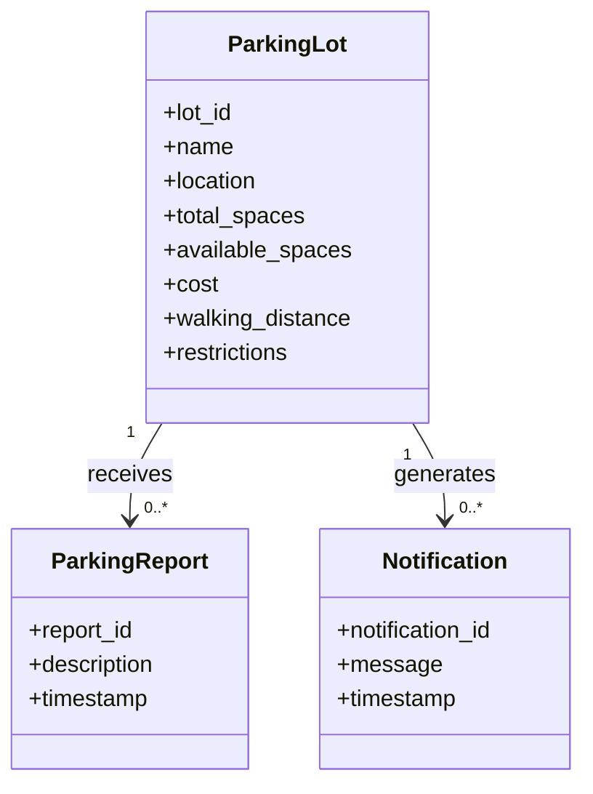

# Domain Model — UofM Parking Survival App

## Overview

The UofM Parking Survival App needs to represent parking lots, reports about parking conditions, and notifications about parking availability.

## Entities

### ParkingLot

* lot_id
* name
* location
* total_spaces
* available_spaces
* cost
* walking_distance
* restrictions

### ParkingReport

* report_id
* description
* timestamp

### Notification

* notification_id
* message
* timestamp

## Relationships

* One ParkingLot can have zero or many ParkingReports.
* One ParkingLot can generate zero or many Notifications.
* A ParkingReport belongs to one ParkingLot.
* A Notification is associated with one ParkingLot.

## Domain Model

## Design Decision

I did not make ParkingStatus a separate entity because the parking status can be calculated from the number of available spaces and total spaces. For example, the Python application can determine whether a lot is Available, Getting Full, or Full.
